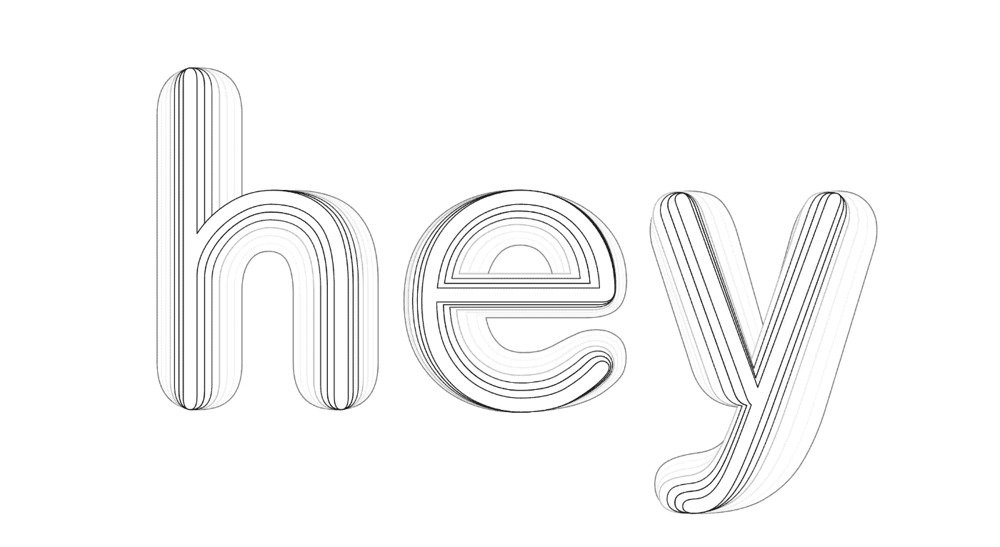
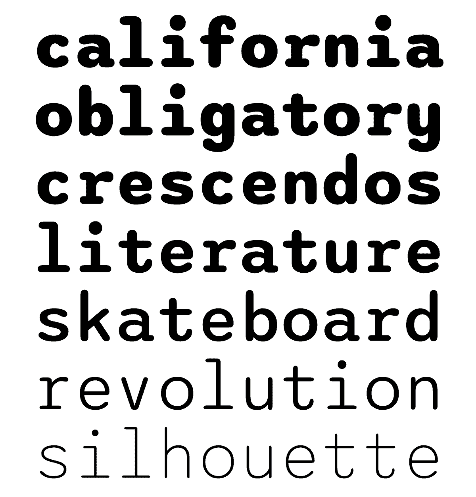
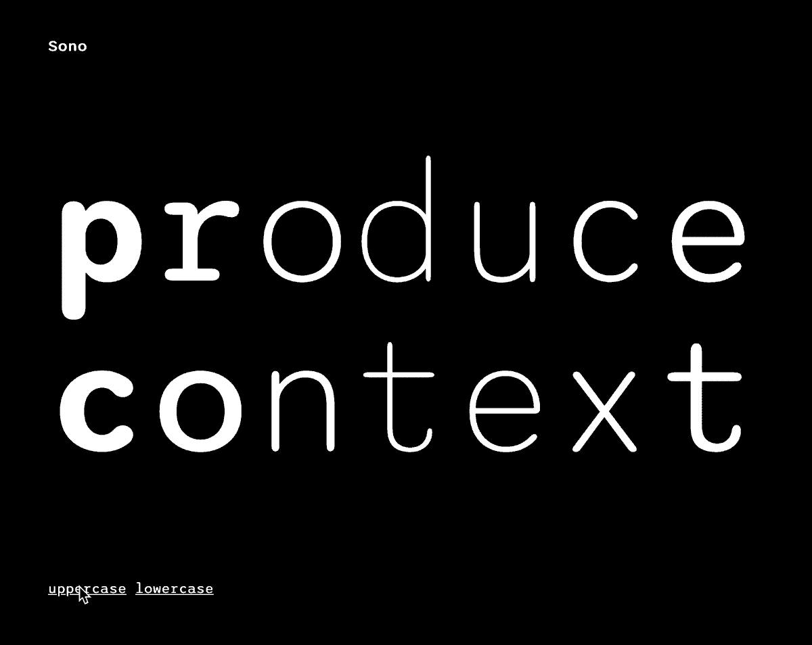
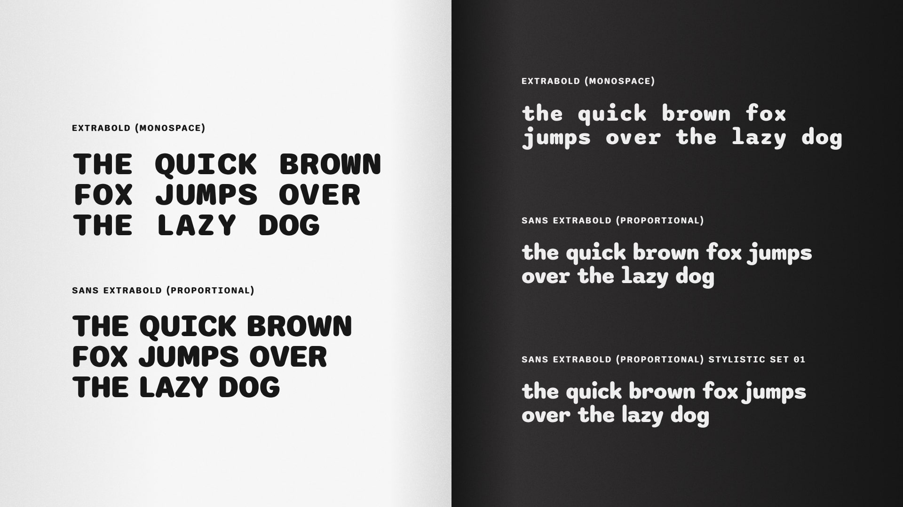
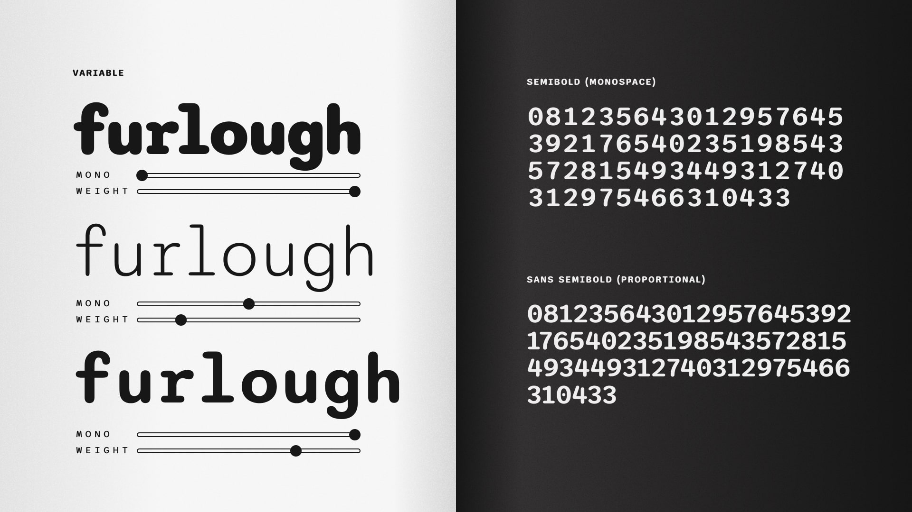

# sono
A soft monospace (or proportional!) variable font by [ty](https://tyfromtheinternet.com)

Seven weights: ExtraLight through ExtraBold. Sono Sans is proportional width glyphs/spacing with kerning. Sono is fixed-width (and obviously not kerned). Variable version (mono, wght) works in Figma 👍 Soon to be on Google Fonts.

These gifs are made from screen recordings of two demo html pages I've included in this repository.

