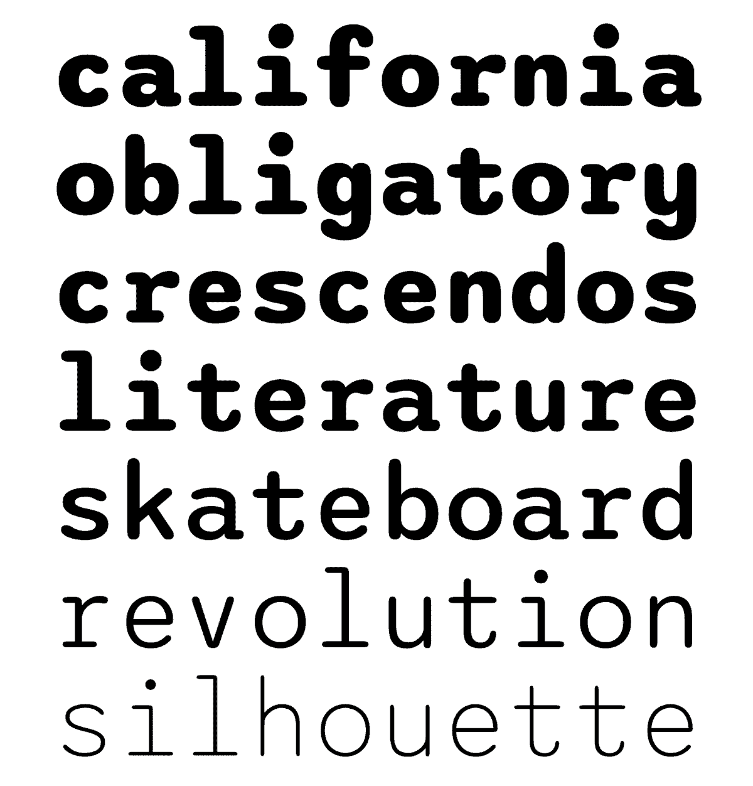

# sono
A soft monospace variable font

Seven weights: ExtraLight through ExtraBold. I started Sono when I launched Public Type Works (currently in limbo). I've worked on it intermittently since then, so while this isn't completely finished, it is pretty functional.

These gifs are made from screen recordings of two demo html pages I've included in this repository.

I'm on Twitter if you need me: https://www.twitter.com/typeler
